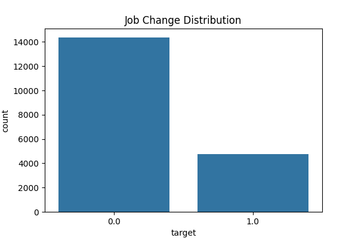
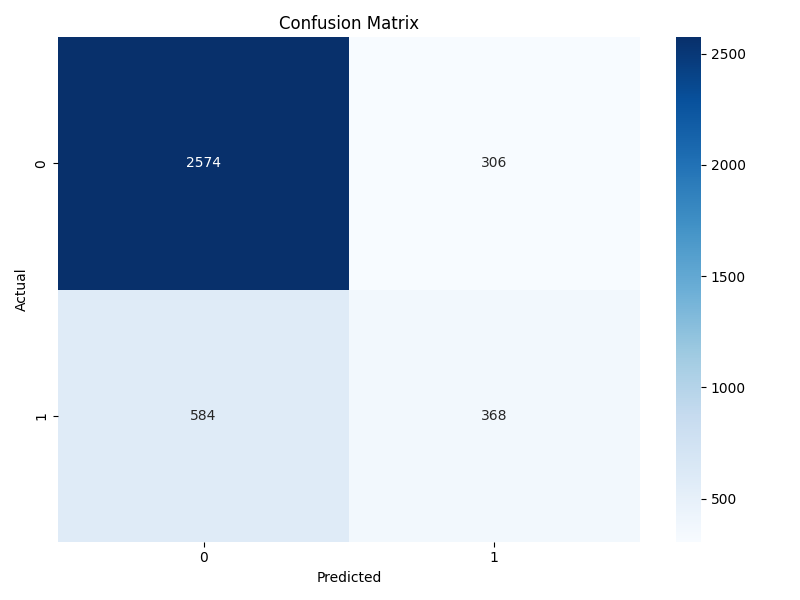
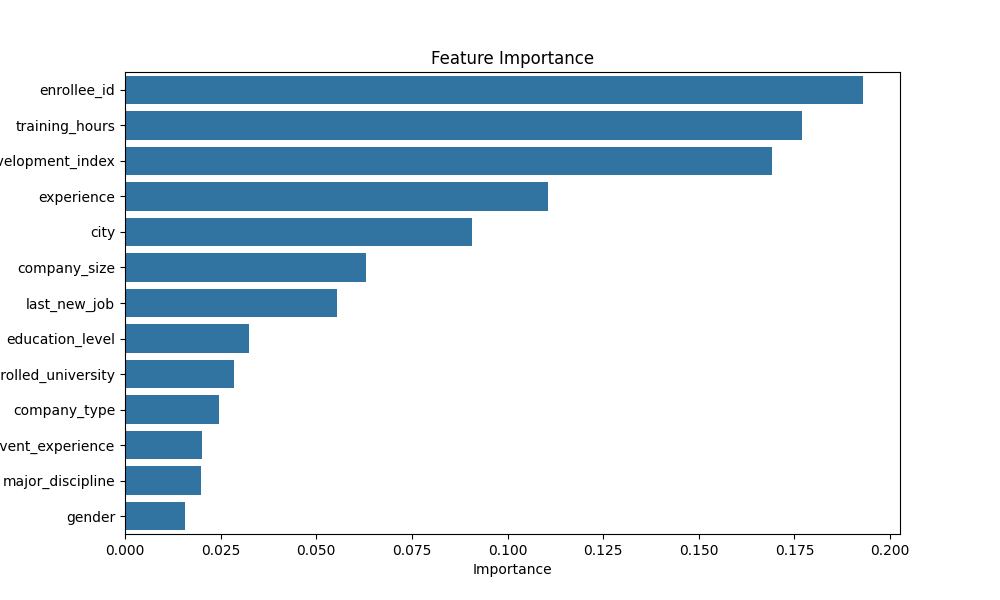

# Employee Job Change Prediction

## Project Overview

This project predicts whether an employee is likely to change jobs using Machine Learning techniques.

The objective is to help organizations identify employees who may be considering a job change and take proactive retention measures.

---

## Dataset

Dataset: HR Analytics – Job Change of Data Scientists

Features include:

- City
- Gender
- Education Level
- Relevant Experience
- Company Size
- Company Type
- Training Hours
- Experience

Target Variable:

- 0 = Not Looking for Job Change
- 1 = Looking for Job Change

---

## Technologies Used

- Python
- Pandas
- NumPy
- Matplotlib
- Seaborn
- Scikit-Learn
- Jupyter Notebook

---

## Data Preprocessing

- Missing Value Treatment
- Exploratory Data Analysis
- Feature Encoding using LabelEncoder
- Train-Test Split

---

## Model Used

Random Forest Classifier

Parameters:

- n_estimators = 100
- random_state = 42

---

## Results

Accuracy: 76.59%

Classification Report:

| Class | Precision | Recall | F1-Score |
|---------|---------|---------|---------|
| 0 | 0.82 | 0.88 | 0.85 |
| 1 | 0.54 | 0.41 | 0.46 |

---

## Visualizations

### Job Change Distribution

### Confusion Matrix

### Feature Importance

---

## Project Structure

employee-job-change-prediction/

├── data/

├── images/

├── notebooks/

├── README.md

└── requirements.txt

---

## Future Improvements

- Hyperparameter Tuning
- XGBoost Classifier
- SMOTE for Class Imbalance
- Model Explainability using SHAP

---

## Author

Charvi Kora